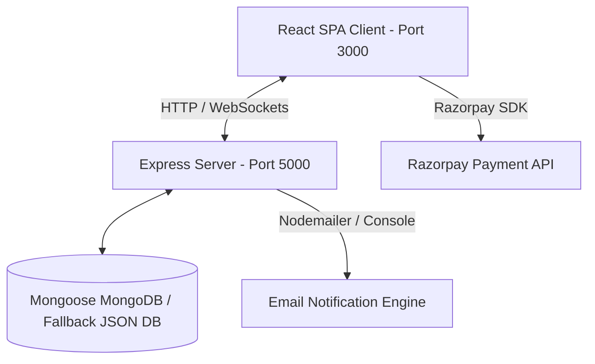

# Pizza Delivery Application — Internship Project Documentation

This document serves as the complete project submission report for the Pizza Delivery Application.

---

## 🍕 Project Overview
The **Slices & Co. Pizza Delivery Application** is a full-stack, high-fidelity web application built using the MERN stack (MongoDB, Express, React, Node.js) and enhanced with real-time WebSockets (Socket.io) and the Razorpay Payment Gateway integration.

It features a responsive, premium glassmorphism interface, a step-by-step custom pizza builder, an admin inventory control panel, a live order dispatch pipeline, and custom-engineered developer helpers.

---

## 🛠️ Architecture & Technology Stack



### 1. Frontend
- **React (Vite)**: Selected for its optimized dev experience and blazing-fast build times.
- **Custom CSS Variables System**: Fully responsive styling employing modern dark aesthetics, glassmorphism filters (`backdrop-filter`), neon accents, and smooth interactive micro-animations.
- **Socket.io-Client**: Establishes continuous bi-directional connections to the backend for instantaneous dashboard updates.

### 2. Backend
- **Node.js & Express**: Lightweight web framework handling routing and state control.
- **Socket.io**: Broadcasts real-time events (`inventoryUpdate`, `orderUpdate`, and individual `orderStatus_<id>` changes).
- **JSON Fallback Engine**: If the Mongoose database connection fails, the app seamlessly reads/writes from a local flat file database at `backend/mock_database.json`, ensuring the app operates out-of-the-box.
- **Nodemailer & Dev Email Log**: A twin email module that forwards real SMTP messages (if credentials are set) and logs sent emails to a global developer queue for immediate inspection.

### 3. Payment Gateway
- **Razorpay Checkout SDK**: Integrated both on the frontend (pop-up script) and backend (HMAC-SHA256 signature verification). Fallback mock mode simulates payment success automatically.

---

## 📝 Features Implemented

1. **Dual Role Access Control**: Features fully validated user accounts, custom login/registration, token-based email verification, and password recovery.
2. **5-Step Custom Pizza Builder**:
   - Step 1: **Pizza Base** (5 Options: Thin Crust, Thick Crust, Gluten-Free, Cheese Burst, Neapolitan Crust)
   - Step 2: **Sauce** (5 Options: Marinara, Spicy Schezwan, Barbecue, Creamy Alfredo, Basil Pesto)
   - Step 3: **Cheese Selection** (Mozzarella, Cheddar, Parmesan, Feta, Vegan Cheese)
   - Step 4: **Opt Veggies** (Onions, Tomatoes, Peppers, Mushrooms, Olives, Jalapenos, Sweet Corn)
   - Step 5: **Opt Meats** (Pepperoni, Grilled Chicken, Sausage, Bacon)
3. **Mini Inventory Management**: An admin panel monitoring stock counts for each ingredient. Warns with a `🚨 Low Stock` tag when counts dip below 20.
4. **Live Pipeline Dispatch**: Interactive dashboard for kitchen staffs to advance order statuses: `Order Received` ➔ `In the kitchen` ➔ `Sent to delivery`. Updates reflect on the user's progress bar in real time without refreshing.
5. **SMTP Threshold Alerts**: Fires automated notification warnings to the admin email when any ingredient is depleted below 20 units.

---

## 🚀 Setup & Execution Guide

### Prerequisites
- Make sure you have **Node.js** (v16+) installed.

### Setup Instructions
1. Open your terminal in the root project folder:
   ```bash
   cd pizza-delivery-app
   ```
2. Install all dependencies for both frontend and backend using the root automation script:
   ```bash
   npm run install-all
   ```
3. Run the development server:
   ```bash
   npm run dev
   ```
4. Access the application:
   - **Frontend UI**: [http://localhost:3000](http://localhost:3000)
   - **Backend API**: [http://localhost:5000](http://localhost:5000)

---

## 🧪 Submission Verification Checklist

Ensure the following workflows are demonstrated during evaluation:
1. **User Sign Up & Auto-Verification**: Create a user. Open the **DEV SANDBOX TOOLBAR** in the bottom-right corner to view the simulated email. Click the verification link to activate the account.
2. **Order Placement**: Customize a pizza using the 5-step builder, checkout using the simulated payment overlay, and watch the order successfully transition to the admin dashboard.
3. **Real-time Pipeline Update**: Log in as an Admin (the first registered user is automatically Admin) and Customer in side-by-side browser windows. Change order status on the Admin panel and witness the customer's dashboard progress bar update instantly.
4. **Low Stock Alert**: Manually edit stock levels of any ingredient below 20 in the Admin panel. Observe the critical email alert display immediately in the Sandbox email log.
